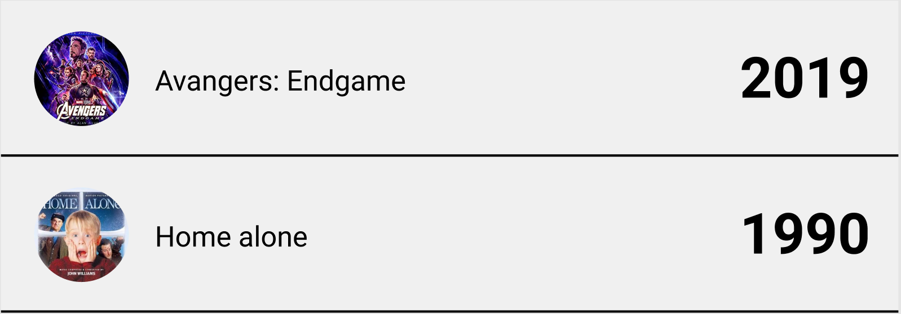
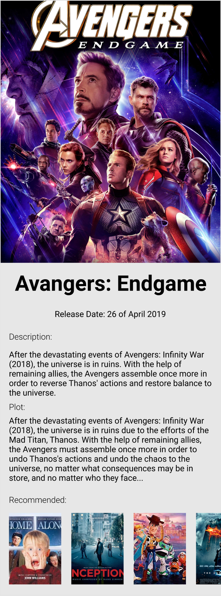

# The challenge
Fork this repo and keep your fork public until we have been able to review it. This challenge is meant to take 2-4 hours to complete.

Implement a simple browser of a movie library. The list of movies is available in JSON format and has examples below in the API section. On tap on a cell open a details page and present details from response of `details/{id}` and `details/recommended/{id}`. Examples of the URLs are in API section below. Use Swift 5.0 for the solution.

There's absolutely no expectation of pixel perfection, so feel free to use the mocks below as a guidance rather than a final design.

Feel free to use any 3rd-party libraries of your choice, but don't overuse and be ready to justify the reason you picked them.

# Mocks
### List example

### Details example

# API

### List 
`https://raw.githubusercontent.com/TradeRev/tr-ios-challenge/master/list.json` to get the list

### Details
Construct the URL using the template `https://raw.githubusercontent.com/TradeRev/tr-ios-challenge/master/details/{id}.json`, 

i.e. https://raw.githubusercontent.com/TradeRev/tr-ios-challenge/master/details/1.json

### Recommended

Construct the URL using the template `https://raw.githubusercontent.com/TradeRev/tr-ios-challenge/master/details/recommended/{id}.json`,

i.e. https://raw.githubusercontent.com/TradeRev/tr-ios-challenge/master/details/recommended/1.json

# Evaluation

Required:
- Solution compiles. If there are necessary steps required to get it to compile, those should be covered in README.md.
- No crashes, bugs, compiler warnings
- Conforms to SOLID principles
- Code is easily understood and communicative
- Commit history is consistent, easy to follow and understand

Nice to have (not required):
- Unit Tests
- Caching
